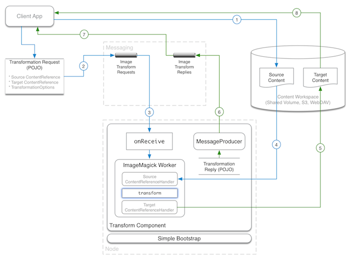

Overview
========

Gytheio (pronounced yee-thee-oh) is a distributed content/file investigation and 
manipulation framework which leverages messaging queues to perform common low-level tasks like:

  * Content change handling
  * Transformations
  * Metadata extraction
  * Hash / checksum computation
…

These tasks can be resource intensive so the focus of the project is on nodes that 
are as lightweight as possible allowing for an extremely scalable platform.

There are several conceptual pieces to the framework which can be mixed and matched in 
whatever manner best fits your needs, though several, common end-to-end implementations 
are available.

* Client: Task messages are generated and sent which contain a reference to the source content and other options needed depending on the task such as a target reference, media type, hash algorithm, etc.  That content reference could be anything the task nodes know how to deal with: a file on a shared volume, an S3 path, a CMIS document ID, etc.

* Routing: A message routing system then directs the request to the appropriate queue for consumption by processing nodes.

* Component: Listens for messages on a relevant queue and call on workers to perform the task on the source content reference, possibly sending a reply which can be consumed by the original requestor or elsewhere.

* Task Nodes: Bootstraps one or more components.

Of course, you can produce messages by other means, plugin a different messaging system and routing, or even use node workers locally and forgo messaging altogether.

Project Layout
==============

Commons
-------

* `gytheio-commons`

Serves as the minimal base for many content definitions, handling, 
and utility operations.

Content Handlers
----------------

* `gytheio-content-handlers/gytheio-content-handler-s3`
* `gytheio-content-handlers/gytheio-content-handler-webdav`

Handle the reading and writing of content references to their corresponding
data store.

Messaging
---------

* `gytheio-messaging/gytheio-messaging-commons`
* `gytheio-messaging/gytheio-messaging-camel`
* `gytheio-messaging/gytheio-messaging-amqp-direct`
* `gytheio-messaging/gytheio-messaging-benchmark`

Defines generic `MessageConsumer` and `MessageProducer` interfaces and Camel and
AMQP implementations which process and send messages and contains a Jackson-based JSON marshaller.

A simple benchmark project is provided to measure the performance of brokers.

Transform
---------

* `gytheio-transform/gytheio-transform-commons`
* `gytheio-transform/gytheio-transform-messaging`
* `gytheio-transform/gytheio-transform-worker-ffmpeg`
* `gytheio-transform/gytheio-transform-worker-imagemagick`
* `gytheio-transform/gytheio-transform-component`

Contains the basic definitions of `TransformationRequest` and `TransformationReply`
objects and the transformation option objects to be sent to content transformers.

The workers are responsible for converting transformation options objects into command-line
or library parameters.

Hash
----

* `gytheio-hash/gytheio-hash-commons`
* `gytheio-hash/gytheio-hash-messaging`
* `gytheio-hash/gytheio-hash-worker-javase`
* `gytheio-hash/gytheio-hash-component`

Contains the basic definitions of `HashRequest` and `HashReply`
objects to be sent to content hash nodes.

The worker is responsible for actually generating the hash.

Nodes
-----

* `gytheio-node-simple`

Bootstraps components above to form executable nodes.

ActiveMQ Broker
---------------

* `gytheio-messaging/messaging-broker-activemq`

A convenience project which can start an ActiveMQ broker with a single Maven command.

Contributing
------------
Thanks for your interest in contributing to this project!

The following is a set of guidelines for contributing to this module. Most of them will make the life of the reviewer easier and therefore decrease the time required for the patch be included in a future version.

Ways to contribute would be by submitting pull requests, reporting issues and creating suggestions. In the case of a defect please provide steps to reproduce the issue, as well as the expected result and the actual one.

You can report an issue in the [ALF](https://issues.alfresco.com/jira/projects/ALF/issues) jira project of the Alfresco issue tracker. Read instructions for a [good issue report](https://community.alfresco.com/docs/DOC-6263-reporting-an-issue).

If you'd like a hand at trying to implement features yourself, please validate your changes by running the tests. Also pull requests should contain tests whenever possible. Please follow the [coding standards](https://community.alfresco.com/docs/DOC-4658-coding-standards).

As a contributor you must sign a contribution agreement, but please keep in mind that the contribution process includes a recorded acceptance step.

* [Submitting Contributions](https://community.alfresco.com/docs/DOC-6269-submitting-contributions)
* [Accepting the Contribution Agreement](https://community.alfresco.com/docs/DOC-7070-alfresco-contribution-agreement)

